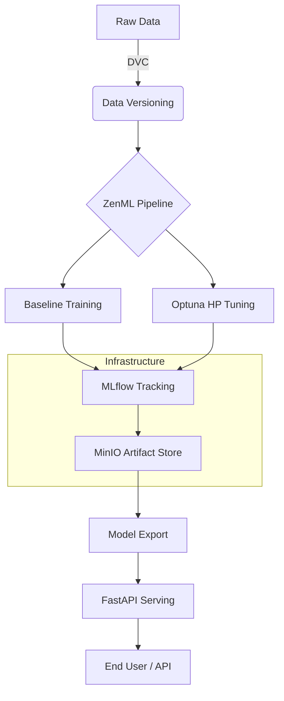

# End-to-End MLOps Pipeline for Breast Cancer Classification

## Project Overview
This project demonstrates a comprehensive MLOps lifecycle for a Breast Cancer Classification task. It integrates modern tools for pipeline orchestration, experiment tracking, data versioning, and model serving. The architecture is designed to be scalable, reproducible, and production-ready.

### Key Technologies
- **Orchestration**: [ZenML](https://zenml.io/)
- **Experiment Tracking**: [MLflow](https://mlflow.org/)
- **Artifact Storage**: [MinIO](https://min.io/) (S3-compatible)
- **Data Versioning**: [DVC](https://dvc.org/)
- **Hyperparameter Tuning**: [Optuna](https://optuna.org/)
- **Model Serving**: [FastAPI](https://fastapi.tiangolo.com/)
- **Containerization**: [Docker](https://www.docker.com/)

---

## System Architecture



---

## Implementation Methodology

The project was executed in 12 structured steps, ensuring a robust and verified setup at each stage.

### 1. Environment & Infrastructure
- **Bootstrap**: Repository and virtual environment setup.
- **Docker Services**: Orchestrated MinIO, MLflow Server, and ZenML Server using Docker Compose.
- **Storage**: Configured MinIO buckets for artifact persistence.

### 2. Data & Experiment Management
- **DVC Integration**: Configured MinIO as a remote for DVC to version the Breast Cancer dataset.
- **MLflow Configuration**: Established tracking to the Dockerized MLflow server with S3-compatible backend storage.

### 3. Pipeline Orchestration (ZenML)
Two primary pipelines were implemented:
1.  **Baseline Pipeline (`v1`)**: Standard Logistic Regression with default parameters.
2.  **Tuning Pipeline (`v2`)**: Integrated **Optuna** to optimize the `C` parameter and `solver` over 10 trials, achieving an F1-score of **~0.986**.

### 4. Model Versioning & Rollback
- **Export Logic**: Automated extraction of the best-performing model from MLflow.
- **Versioning**: Models are stored with version tags (`model_v1.pkl`, `model_v2.pkl`).
- **Rollback Proof**: A dedicated script (`src/rollback.py`) allows near-instant switching between model versions for the serving layer.

---

## How to Run

### Prerequisites
- Docker & Docker Compose
- Python 3.13+

### 1. Start Infrastructure
```bash
docker compose up -d
```

### 2. Run Pipelines
```bash
# Activate environment
source venv/bin/activate

# Run Baseline
python pipelines/zenml_pipeline.py

# Run Optuna Tuning
python pipelines/zenml_tuning_pipeline.py
```

### 3. Model Management
```bash
# Export best model from MLflow
python src/export_best_model.py

# Rollback to v1
python -m src.rollback --version v1
```

### 4. Serving
The API starts automatically with Docker, or can be run locally:
```bash
uvicorn src.api:app --host 0.0.0.0 --port 8000
```

---

## Results & Deliverables
- **Reproducibility**: Entire pipeline from data loading to serving is automated.
- **Visibility**: All trials and artifacts are visible in the MLflow UI (http://localhost:5000) and ZenML Dashboard (http://localhost:8237).
- **Scalability**: The use of S3-compatible storage and centralized tracking allows for team-based collaboration.

---
**Author**: Oussama Rachdi  
**Course**: MLOps Mini-Project  
**Date**: January 2026
